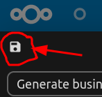

# Admin documentation

Before users can start using any custom actions, you must add them through the admin menu. These can be found in the `File actions` section, in the administration settings menu. On a fresh install some ready-made actions should be available there (albeit disabled for the user).

## User input
Other than the selected files, you can ask the user to input other details as part of the action.  Any number of additional input values can be added in the script-creation view, the values can be accessed in your script via the [`get_input()`](Functions.md#get_input) function. 

By default, input types are text-fields where the user may type in the value. However other, more restrictive input types may be used:

- **Checkbox** allows for a boolean (`true`/`false`)  input from the user
- **Multiselect** allows the user to select from a set of pre-determined inputs.
- **File-picker** allows the user to choose a document from their Nextcloud files. 

Note: to allow a user to pick a folder the `httpd/unix-directory` mimetype must be added to the filepick options. To properly add a mimetype, be sure to:

1. Press the arrow button and save icon: 
2. Press the additional save icon in the top left 

### Required fields
User input fields will always be optional: the action may still be triggered even if the user did not input anything. However, additional checks can be performed on the script itself, and an [error](Functions.md#abort) may be returned to the user if any required fields were not (correctly) filled.

```lua
local file_name = get_input('file_name')
if (not file_name or string.len(file_name) == 0) then
  abort('File name was not filled in.')
end 
```


## Scripting

### [Scripting API](Functions.md)
Reading through the function descriptions and snippets you can get an idea of what is possible to do with file actions.

You can also find example scripts in the [`examples/`](/examples) folder of the repository, these examples will be also included when you first install the app on your server.

### Nextcloud objects
The scripting API has been extended with Nextcloud-specific functions. These functions may require a "Folder" or a "File" as an input. Lua of course does not know what a file or a folder are, so instead we rely on Lua tables to carry the information required to represent these objects.

These tables may be manually created, but it is preferable to use function that return these objects.

#### Node (File / Folder)
The `Node` type is used to represent a file or folder (see: [`is_file`](Functions.md#is_file) and [`is_folder`](Functions.md#is_folder)), it can also be expanded with [`meta_data`](Functions.md#meta_data) to include more information:
 * `id`: the internal ID of the file or folder
 * `name`: the name of the file or folder
 * `path`: the path (not including the name) to the file or folder from the user's home folder 

#### User
 * `uuid`: the unique identifier for the user
 * `display_name`: the chosen display name by the user
 * `email_address`: the user's email address

#### Tag
 * `id`: the unique (numeric) ID of the tag
 * `name`: the tag's name (as shown to in the Nextcloud interface)
 * `user_assignable`: whether the tag can be assigned by users
 * `user_visible` whether the tag is made visible to the users
 * `access_level`: internal access level code for the tag (`0: public`, `1: restricted`, `2: invisible`)

### Testing scripts

If you are writing a new script and need to test it I would highly advise using a test environment. This will avoid any mishaps from affecting any live data.

If for any reason you must test your scripts on a production server, and do not want to make the scripts available to users yet, you can limit the script to the "admin" group, by ticking the `Limit to groups` option.

## Flow

Actions can also be configured to work with Nextcloud's automated flows. Note that disabled actions are available to be configured with Flow, so you can hide these from users.

When running a script from a flow `get_input_files()` will only contain the file that triggered the flow, and `get_target_folder()` will be the folder containing the file. 

Additionally, for "file rename" and "file copy" events, the previous file's path can be accessed with: `get_input('old_node_path')`


## OCC commands

In some cases it might be desirable to run scripts via occ (e.g. running scripts on cron-jobs), to do this you can use the command:
```sh
occ files_scripts:run <id> --user <userid> --inputs "{ \"input_var\": \"hello world\" }"
```

To get the `<id>` value, you can use the scripts-list command:
```sh
occ files_scripts:list
```

To get the `<userid>` value, you can use the user-list command:
```sh
occ user:list
```
